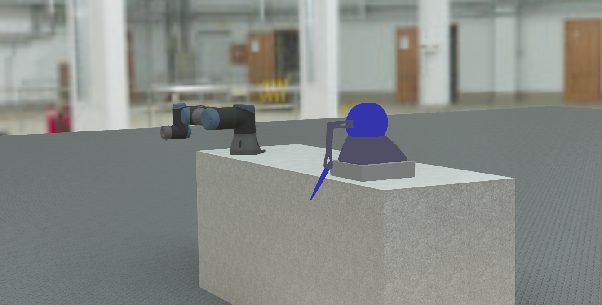

# Webots ROS 2 Geomagic Omni Touch and UR3 Integration

This project integrates the Phantom Omni and UR3 robots into a Webots simulation environment using ROS 2. It provides functionality for controlling the robots via ROS 2 action servers and simulating their behavior in Webots.

---

## Features
- **Phantom Omni and UR3 Robot Simulation**: Simulate both robots in Webots.
- **ROS 2 Integration**: Control the robots using ROS 2 action servers.
- **Trajectory Control**: Send joint trajectory goals to the robots.
- **Webots Supervisor**: Manage simulation resets and robot states.

---

## Prerequisites

- Ubuntu 22.04
- ROS2 Humble https://docs.ros.org/en/humble/Installation/Ubuntu-Install-Debians.html
- Webots 2025a https://github.com/cyberbotics/webots/releases/tag/R2025a

## Installation

1. Create a workspace:

    ```
    export COLCON_WS=~/ros2_ws
    mkdir -p $COLCON_WS/src
    ```
2. Pull relevant packages, install dependencies, compile, and source the workspace by using:

    ```
    cd $COLCON_WS
    git clone https://github.com/cyberbotics/webots_ros2.git
    rosdep install --ignore-src --from-paths src -y -r
    chmod +x src/webots_ros2/webots_ros2_driver/webots_ros2_driver/ros2_supervisor.py
    sudo apt install ros-humble-ur-description
    ```

3. Build the workspace 

    ```
    colcon build --symlink-install
    source install/setup.bash
    ```

The launch file and demo node are self explanatory

TODO: setup moveit2 config files and launch file
